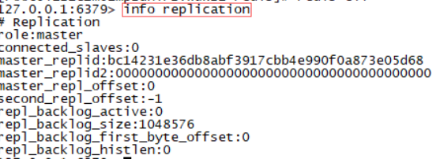
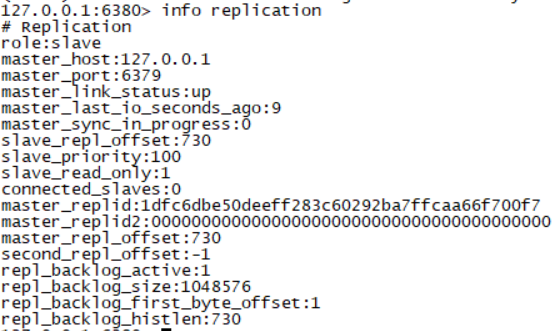
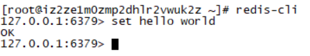
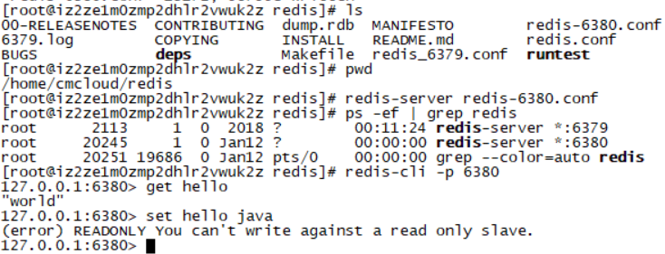
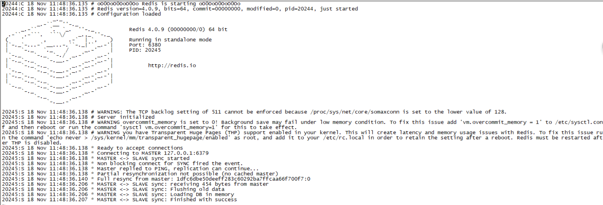
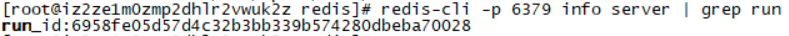
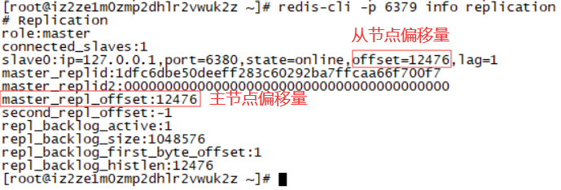
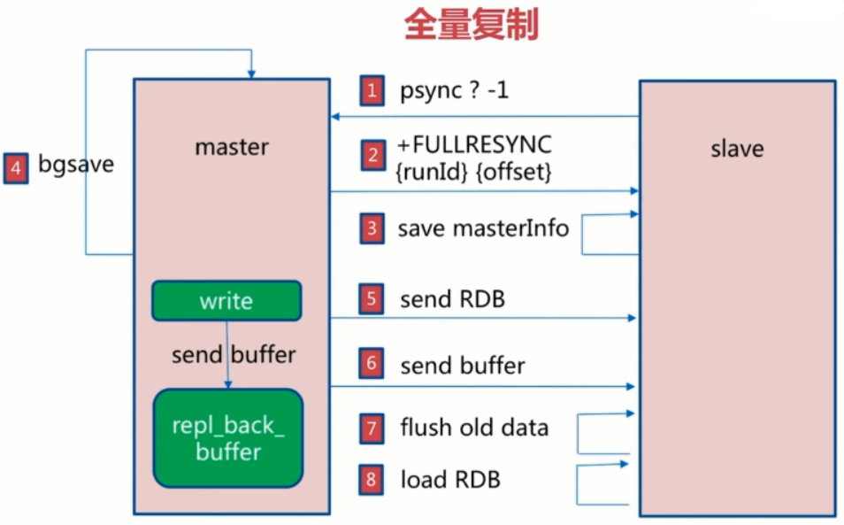
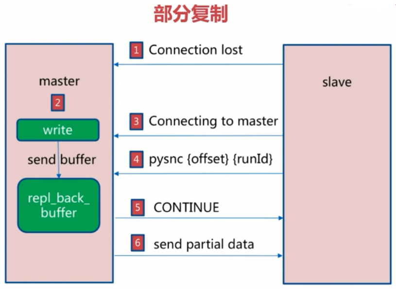

# Redis主从复制


## 什么是主从复制

### 单机有什么问题

- 机器故障
- 容量瓶颈
- QPS瓶颈

### 主从复制的作用

- 数据副本
- 扩展读性能

### 简单总结

- 一个master可以有多个slave
- 一个slave只能有一个master
- 数据流向是单向的，master到slave

## 复制的配置

### slaveof命令

成为127.0.0.1 6379的从节点

```shell
slaveof 127.0.0.1 6379
```

取消复制,不成为任何master的子节点，并且不会清除之前同步过来的master的数据

```shell
slaveof no one
```

### 配置

```shell
slaveof ip port
#只做读的操作,这样就可以和master一样了
slave-read-only yes
```
两种方式比较

| 方式 | 命令       | 配置     |
| ---- | ---------- | -------- |
| 优点 | 无需重启   | 同一配置 |
| 缺点 | 不便于管理 | 需要重启 |

主节点配置(redis-6379.conf)：

```
port 6379
daemonize yes
pidfile /var/run/redis-6379.pid
logfile "6379.log"

#save 900 1
#save 300 10
#save 60 10000

#不同节点如果用的一个工作目录，rdb节点名要不同
dbfilename dump-6379.rdb
 
#工作目录
dir /opt/soft/redis/redis/data

```

从节点配置(redis-6380.conf)：

```
#修改端口
port 6380

daemonize yes
pidfile /var/run/redis-6380.pid
logfile "6380.log"

#save 900 1
#save 300 10
#save 60 10000

#不同节点如果用的一个工作目录，rdb节点名要不同
dbfilename dump-6380.rdb
 
#工作目录
dir /opt/soft/redis/redis/data

#
slaveof 127.0.0.1 6379 

#当master服务设置了密码保护时，slav服务连接master的密码
masterauth 123456

#只读
slave-read-only yes
```

先后启动

```
redis-server redis-6379.conf
ps -ef | grep redis
redis-cli
#进入到redis里
#查看分片
info replication
```






主服务 set hello



从服务 get hello




6380的日志



## 全量复制和部分复制

run id：每次启动都有的一个唯一标识



偏移量：



### 全量复制

#### 全量复制步骤

1. slave从节点向主节点发送请求 psync?-1(在不知道runid和偏移量的情况下，所以用? 和-1)
2. master接收到请求后知道slave节点要做全量复制，就回发FULLRESYNC{runId}{offset}(带着runid和偏移量)
3. slave从节点保存master回发的masterInfo信息
4. master节点执行bgsave，通过缓冲区将同步时正在写入的信息也保存下来 	 
5. master节点传输数据
6. slave节点flush old data删除老的数据
7. 然后load RDB加载老的数据



#### 全量复制的开销

1. bgsave的时间（fork操作，对cpu，内存，硬盘都有开销）
2. RDB文件网络传输时间
3. 从节点清空数据时间
4. 从节点加载RDB的时间
5. 可能的AOF重写时间（加载RDB的时候，如果达到AOF条件，还会触发AOF重写）

### 部分复制

redis2.8以后提供部分复制功能，在网络抖动的时候，将损失降到最低。

原理：

网络断开以后master节点还是执行2向缓冲区写入数据，当连接恢复时，slave节点再向master节点发送偏移量，如果偏移量在buffer的偏移量范围之内，继续传送




## 故障处理

slave宕掉


### a.读写分离

#### 1.读写分离：读流量分摊到从节点

主节点用来读，从节点用来写


#### 2.可能遇到问题：

- 复制数据延迟（主节点数据没来得及复制，从节点就被读了，slave阻塞时会延迟收到写的命令）
- 读到过期数据（主节点key过期有两种方式，一种是懒方式，可能这个key过期了，但是状态还没有同步到从节点）
- 从节点故障

### b.配置故障

1. 例如maxmemory不一致：丢失数据

2. 例如数据结构优化参数（例如hash-max-ziplist-entries）：内存不一致（主节点优化了，内存小了）

   

### c.规避全量复制

#### 发生全量复制的情况

1.第一次全量复制

- 第一次不可避免
- 小主节点、低峰   

2.节点运行ID不匹配

- 主节点重启（运行ID变化）
- 故障转义，例如哨兵或集群

3.复制积压缓冲区不足

- 网络中断，部分复制无法满足
- 增大复制缓冲区配置rel_backlog_size，网络“增强”


### d.规避复制风暴

主节点重启后，所有的从节点都要复制，因为runID发生了变化

#### 1.单主节点复制风暴

- 问题：主节点重启，多从节点复制
- 解决：更换复制拓扑


#### 2.但机器复制风暴

机器宕机后，大量全量复制（machine-A要做大量bgsave和网络传输）


解决：主节点分数多机器